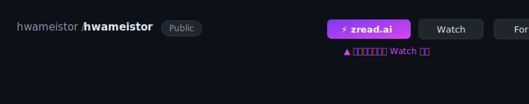

<p align="center">
  
</p>

<h1 align="center">GitHub → zread.ai</h1>

<p align="center">
  <a href="https://github.com/LeonDevLifeLog/zread-chrome-extension/blob/main/LICENSE"></a>
  <a href="https://github.com/LeonDevLifeLog/zread-chrome-extension/releases"></a>
  
  
</p>

<p align="center">
  在 GitHub 仓库页面注入一个高亮按钮，一键在新标签页跳转到对应的 zread.ai 页面。
</p>

---

> **English summary:** A lightweight Chrome extension (Manifest V3) that injects a highlighted
> **⚡ zread.ai** button into GitHub repository pages. Clicking it opens the equivalent
> [zread.ai](https://zread.ai) page in a new tab by simply swapping `github.com` → `zread.ai`
> while keeping the full path, query string, and hash intact.

## ✨ 功能特性

- **一键跳转**：在任意 GitHub 仓库页注入按钮，点击即跳转到对应的 zread.ai 页面。
- **路径零丢失**：仅将主机名 `github.com` 替换为 `zread.ai`，路径、查询参数、哈希全部保留。
  例如 `https://github.com/owner/repo/tree/main?tab=readme` → `https://zread.ai/owner/repo/tree/main?tab=readme`。
- **新标签页打开**：以 `<a target="_blank">` 打开，不打断当前阅读。
- **醒目高亮**：紫色渐变背景 + 呼吸光晕动画，放置在 **Watch 按钮左侧**，并与 Watch / Fork / Star 同尺寸对齐。
- **适配 SPA 路由**：监听 GitHub 的 Turbo 渲染事件 + `MutationObserver` 兜底，切换仓库时按钮自动重注、去重。
- **极简权限**：纯 content script，无后台常驻、无第三方网络请求、不上传任何数据。

## 📸 效果预览



高亮按钮会注入在仓库页头操作区（Watch / Fork / Star 所在一行）的**最左侧**，即 Watch 按钮的左侧。

## 🔧 工作原理

1. `manifest.json` 声明 content script 匹配 `https://github.com/*`，页面空闲时注入 `content.js`。
2. `content.js` 判断当前是否为仓库页（`pathname` 至少包含 `owner/repo` 两段），非仓库页不展示按钮。
3. 通过 `URL` 对象把当前地址的主机名改为 `zread.ai`，生成目标链接。
4. 将高亮 `<a>` 按钮插入到 `[data-testid="repo-header-actions"]` 列表首项（即 Watch 左侧）；
   若结构不匹配则回退到 Watch 控件前 / 页头 flex / 右上角浮动。
5. 监听 `turbo:render` 与 DOM 变化，保证 SPA 切换仓库后按钮始终存在且不重复。

## 📦 安装方式

### 方式 A：开发者模式加载（推荐，零成本）

1. 打开 `chrome://extensions`（或 Edge 的 `edge://extensions`）。
2. 右上角开启 **开发者模式（Developer mode）**。
3. 点击 **加载已解压的扩展程序（Load unpacked）**，选择本仓库根目录（包含 `manifest.json` 的文件夹）。
4. 打开任意 GitHub 仓库页（如 <https://github.com/hwameistor/hwameistor>），即可看到 Watch 左侧的高亮按钮。

> 更新代码后，在 `chrome://extensions` 页面点击该扩展卡片上的 **刷新** 图标即可生效，无需重新加载目录。

### 方式 B：Chrome 应用商店（规划中）

商店上架尚在规划中。发布后此处的按钮将直接跳转到商店安装页。你也可以先 star / watch 本仓库以获取进展通知。

## 🚀 使用说明

1. 在浏览器中打开任意 GitHub 仓库页面。
2. 在页面顶部的操作区（Watch 左侧）找到紫色高亮的 **⚡ zread.ai** 按钮。
3. 点击即可在新标签页打开对应的 zread.ai 页面。

## 🔐 权限说明

| 权限 | 用途 |
| --- | --- |
| `https://github.com/*` | 注入按钮并读取当前页面 URL，用于构造目标链接。 |
| `https://zread.ai/*` | 声明跨域主机权限（跳转目标站点）。 |

扩展**不会**访问除上述站点外的任何页面，**不会**发起任何第三方网络请求，**不会**收集、存储或上传任何用户数据。

## 🛡 隐私

本项目无遥测、无分析、无账号系统。所有逻辑均在本地 content script 中运行，仅对 `github.com` 页面做 DOM 注入，并在新标签页打开 `zread.ai`。详见 [LICENSE](LICENSE)。

## 🛠 本地开发

```bash
# 克隆仓库
git clone https://github.com/LeonDevLifeLog/zread-chrome-extension.git
cd zread-chrome-extension

# 在 chrome://extensions 用「加载已解压的扩展程序」选择本目录即可
```

主要文件：

- `manifest.json` — 扩展声明（Manifest V3）。
- `content.js` — 按钮注入与跳转逻辑（核心代码）。
- `icons/` — 16 / 48 / 128 像素扩展图标。

调试技巧：

- 在扩展卡片开启「开发者模式」后，点击「检查视图 → 服务工作进程 / 报错」可查看 content script 的 `console` 输出。
- 若按钮未出现在预期位置，请提交 issue 并附上**具体仓库 URL** 与浏览器版本。

## 🤝 贡献

欢迎提交 Issue 与 Pull Request！

- 反馈问题请使用 **Bug report** 模板，并尽量附上复现步骤与仓库 URL。
- 新功能建议请使用 **Feature request** 模板。
- 提交 PR 前请阅读 [CONTRIBUTING.md](CONTRIBUTING.md)。

## 📄 许可证

本项目基于 [MIT License](LICENSE) 开源。

## 🔗 相关链接

- zread.ai：<https://zread.ai>
- 仓库地址：<https://github.com/LeonDevLifeLog/zread-chrome-extension>
